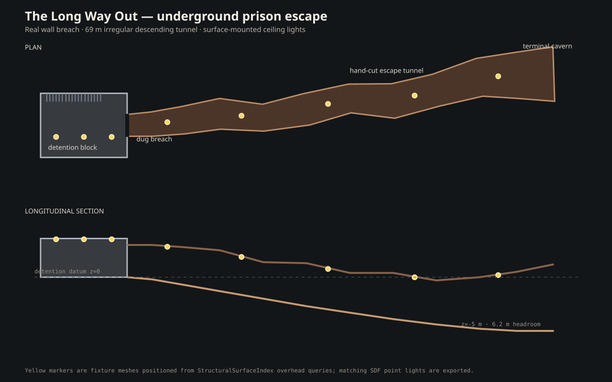

# The Long Way Out

This deterministic showcase builds an underground prison block where someone
has broken a 3.6 m-wide opening through the wall into a long, irregular escape
tunnel. The tunnel descends about 5 m over roughly 69 m, widens into a terminal
chamber, and has ceiling-mounted light fixtures placed from actual overhead
surface queries.



## Generate it

From the repository root:

```bash
.venv/bin/python -m examples.prison_escape.generate_scene
```

The committed `generated/` output contains:

- `prison_escape.dmd.yaml` — Drake model directives for the complete scene;
- `structural_layout.json` — the v2 semantic layout and embedded-passage spec;
- `structures/` — compiled visual/collision OBJ, SDF, and semantic-surface
  sidecars for the prison and tunnel;
- `details/` — barred cells, bunks, breach rubble, emissive ceiling fixtures,
  and matching SDF point lights;
- `manifest.json` — dimensions, surface-mount evidence, topology, and route
  validation results;
- `preview.svg` — dependency-free plan and longitudinal-section preview.

## What this proves

The opening is not decoration: it is a portal cut from both visual and collision
wall meshes. The tunnel is an imported-style freeform structural shell whose
floor, wall, and overhead triangles have explicit roles. Its natural-passage
connector uses `geometry_embedded: true`, so SceneSmith checks the authored
centerline for floor support and headroom without creating duplicate geometry.

Each light fixture is positioned and oriented using
`StructuralSurfaceIndex.overhead_pose`; the exported manifest names the exact
surface patch used for every mount. The route is generated only if a 1.9 m tall,
0.45 m radius walking agent can traverse it without a support or headroom veto.
